# 04 — Project Architecture

This document describes the end-to-end architecture of the pipeline:
the inputs at each phase, the transformations applied, the outputs
produced, and the cross-phase dependencies.

## 1. Mermaid Pipeline Diagram

```mermaid
flowchart LR
    A[NASA CMAPSS<br/>train_FD001.txt<br/>test_FD001.txt<br/>RUL_FD001.txt]
    A --> P1[Phase 1<br/>Data Cleaning &amp; Preprocessing]
    P1 -->|scaled sensors + reference IDs| P2[Phase 2<br/>Feature Engineering]
    P2 -->|212 engineered columns + RUL target| P3[Phase 3<br/>Model Training]
    P3 -->|3 joblib models + metadata.json| P4[Phase 4<br/>RUL Prediction]
    P4 -->|100 rows per model| P5[Phase 5<br/>Performance Evaluation]
    P5 -->|metrics table + 4 PNGs| P6[Phase 6<br/>Feature Importance]
    P6 -->|per-model + SHAP + sensor-level CSVs/PNGs| P7[Phase 7<br/>Maintenance Recommendation]
    P7 -->|recommendations + dashboard| OUT[Fleet-level maintenance plan]
```

## 2. Phase-to-Phase Dependencies (file-level)

| From | To | Files passed |
|---|---|---|
| Phase 1 → Phase 2 | `train_FD001_scaled.csv`, `test_FD001_scaled.csv`, `train_FD001_reference.csv`, `test_FD001_reference.csv`, `RUL_FD001_reference.csv`, `robust_scaler.pkl`, `preprocessing_metadata.json` |
| Phase 2 → Phase 3 | `train_FD001_engineered.csv` |
| Phase 3 → Phase 4 | `models/random_forest_rul.joblib`, `models/xgboost_rul.joblib`, `models/neural_network_rul.joblib`, `models/training_metadata.json` |
| Phase 2 → Phase 4 | `test_FD001_engineered.csv` |
| Phase 3 → Phase 6 | the three `*.joblib` files + `training_metadata.json` |
| Phase 2 → Phase 6 | `train_FD001_engineered.csv` (used as the SHAP background) |
| Phase 4 → Phase 5 | the three `*_predictions.csv` files |
| Phase 1 → Phase 5 | `RUL_FD001_reference.csv` (ground truth) |
| Phase 4 → Phase 7 | `neural_network_predictions.csv` (best model) |
| Phase 7 → Dissertation | `maintenance_recommendations.csv`, `maintenance_summary.csv`, dashboard PNG |

## 3. Data Flow per Phase

### Phase 1 — Data Cleaning & Preprocessing
* **Inputs:** three raw `.txt` files.
* **Transforms:** column naming → type check → duplicate check →
  variance check → descriptive statistics → outlier analysis → drop 5
  columns → `RobustScaler` fit on train / transform on test.
* **Outputs:** scaled CSVs, reference CSVs, scaler object,
  `preprocessing_metadata.json`, statistical CSVs, 8 PNGs.

### Phase 2 — Feature Engineering
* **Inputs:** scaled train + reference IDs (Phase 1).
* **Transforms:** RUL target creation → rolling mean/std for windows
  3, 5, 10 → lag features for windows 1, 2, 3, 5 → delta and
  cumulative-delta features → Pearson correlation filter at `|r| >
  0.95` → validation.
* **Outputs:** engineered CSVs (212 columns + RUL + IDs), feature
  importance CSV, feature list, two Markdown documents.

### Phase 3 — Model Training
* **Inputs:** `train_FD001_engineered.csv` (Phase 2).
* **Transforms:** separate `X` / `y` → train Random Forest → train
  XGBoost → train MLP → save models and metadata.
* **Outputs:** three `*.joblib` models + `training_metadata.json`.

### Phase 4 — RUL Prediction
* **Inputs:** engineered test CSV + three trained models.
* **Transforms:** per engine, pick the last observed cycle → predict
  RUL with each model → write per-model CSV.
* **Outputs:** three `*_predictions.csv` files (100 rows each).

### Phase 5 — Performance Evaluation
* **Inputs:** three prediction CSVs + ground-truth RUL CSV.
* **Transforms:** align by `Unit_Number` → compute MAE, MSE, RMSE, R²
  → save summary + four figures.
* **Outputs:** `performance_metrics_summary.csv`, four PNGs, summary
  Markdown.

### Phase 6 — Feature Importance Analysis
* **Inputs:** engineered training CSV + three trained models + metadata.
* **Transforms:** tree importances for RF and XGBoost → SHAP for the
  MLP with 50-row background and 200-row evaluation set → combine
  top-20 → aggregate by base sensor family.
* **Outputs:** five CSVs, five PNGs, summary Markdown.

### Phase 7 — Maintenance Recommendation
* **Inputs:** NN predictions + threshold rules.
* **Transforms:** classify per engine → render dashboard PNG → save
  CSV and Markdown summary.
* **Outputs:** `maintenance_recommendations.csv`,
  `maintenance_summary.csv`, five PNGs, summary Markdown.

## 4. Cross-Cutting Engineering Decisions

* **Dynamic paths** — every driver uses
  `SCRIPT_DIR = Path(__file__).resolve().parent`, then navigates to
  sibling phase folders. No hard-coded user paths exist.
* **Git LFS** — `.joblib` artefacts are stored via LFS (see
  `.gitattributes`).
* **Hygiene** — `__pycache__/`, `*.pkl`, `*.png`, metadata JSONs and
  the `FOLDER_STRUCTURE_MAP.txt` placeholder are excluded by
  `.gitignore`.
* **Reproducibility** — every driver declares `RANDOM_STATE = 42`
  and the metadata file records this.
* **Single-condition assumption** — FD001 only; FD002–FD004 are
  referenced as future work in
  `07_Maintenance Recommendation/maintenance_recommendation_summary.md`.

## 5. Architecture Strengths

* **Single responsibility per phase** — each phase folder has one
  driver and a small set of numbered sub-scripts.
* **End-to-end reproducibility** — running the seven drivers in
  numerical order reproduces every artefact.
* **No manual steps** — every transformation is encoded in a script.

## 6. Architecture Limitations

* **No live data ingestion** — the pipeline is offline / batch.
* **No model registry** — models are versioned only by filename.
* **No experiment tracking** — there is no MLflow or similar; metric
  comparison relies on `performance_metrics_summary.csv`.
* **Single operating condition** — FD001 is constant-condition, so
  the architecture would need adaptation for FD002/FD003/FD004
  (operating settings would have to be re-introduced as features).